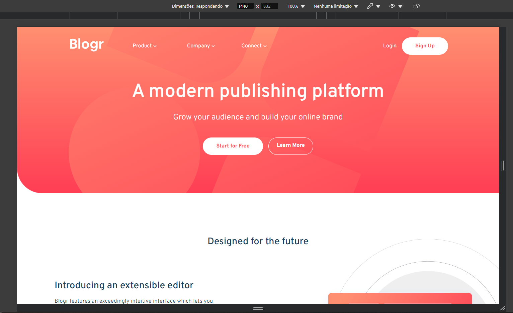
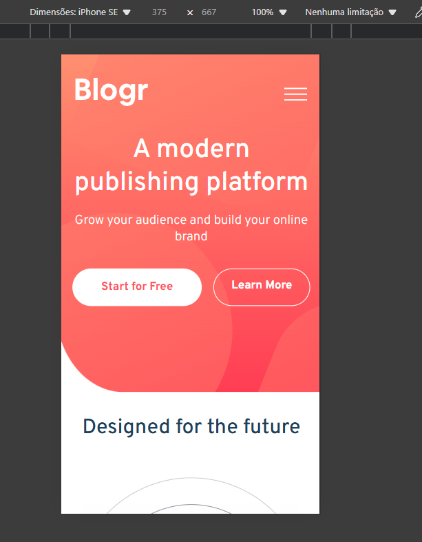

# Frontend Mentor - Blogr landing page solution

This is a solution to the [Blogr landing page challenge on Frontend Mentor](https://www.frontendmentor.io/challenges/blogr-landing-page-EX2RLAApP). Frontend Mentor challenges help you improve your coding skills by building realistic projects. 

## Table of contents

- [Overview](#overview)
  - [The challenge](#the-challenge)
  - [Screenshot](#screenshot)
  - [Links](#links)
- [My process](#my-process)
  - [Built with](#built-with)
  - [What I learned](#what-i-learned)
  - [Continued development](#continued-development)
  - [Useful resources](#useful-resources)
- [Author](#author)
- [Acknowledgments](#acknowledgments)

**Note: Delete this note and update the table of contents based on what sections you keep.**

## Overview

### The challenge

Users should be able to:

- View the optimal layout for the site depending on their device's screen size
- See hover states for all interactive elements on the page

### Screenshot

 - #### Desktop
  

 - ### Mobile
 

### Links

- Solution URL: [Here](https://www.frontendmentor.io/solutions/blogr-landing-page-solution-using-mobile-first-QNjdDtE-8L)
- Live Site URL: [Here](https://ferrmath.github.io/blogr-landing-page-main/)

## My process

### Built with

- Semantic HTML5 markup
- CSS custom properties
- Flexbox
- CSS Grid
- Mobile-first workflow

### Continued development

As of now, I'm not satisfied with the quality of the code I made for this project, even if it currently works perfectly. As such I plan to redo the challenge with different approaches, specialy regarding the background images and organization of the code.

## Author

- Website - [Matheus A.](https://github.com/FerrMath)
- Frontend Mentor - [@FerrMath](https://www.frontendmentor.io/profile/FerrMath)

